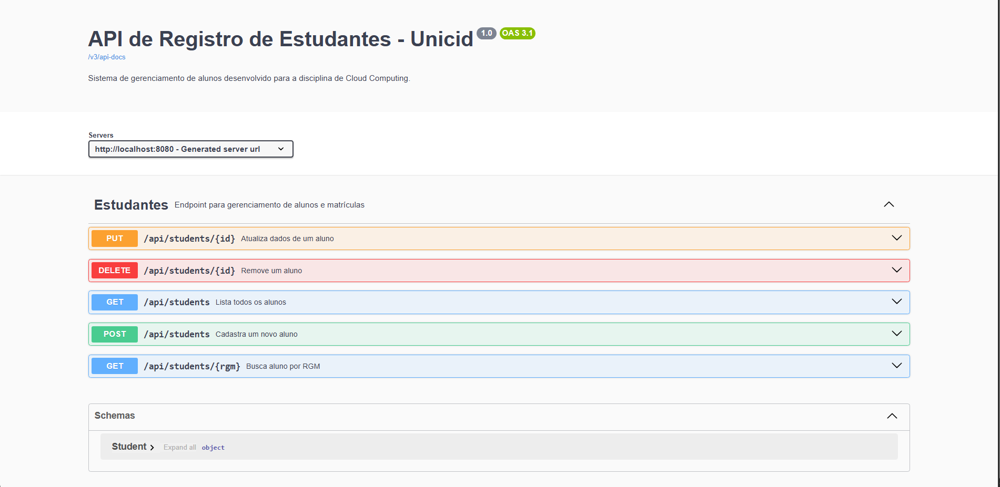
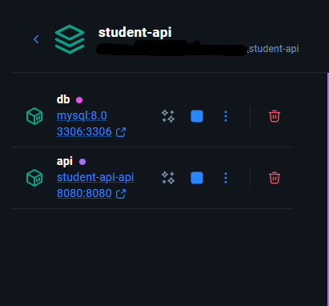

# 🎓 Student Registration API (Cloud-Ready)

Esta API REST foi desenvolvida para o gerenciamento de registros de estudantes, servindo como um projeto prático para consolidar conceitos de **Arquitetura de Software**, **Resiliência** e **Containerização**.

A aplicação permite o ciclo completo de CRUD (Create, Read, Update, Delete) com persistência em banco de dados relacional e documentação interativa.

---

## 🚀 Tecnologias e Ferramentas

* **Backend:** Java 21 com Spring Boot 3.
* **Persistência:** Spring Data JPA & MySQL.
* **Documentação:** OpenAPI 3 (Swagger).
* **Infraestrutura:** Docker & Docker Compose.
* **Produtividade:** Project Lombok.

---

## 🏗️ Arquitetura e Diferenciais Técnicos

### 1. Gestão Global de Exceções
Implementei um `GlobalExceptionHandler` utilizando a anotação `@ControllerAdvice`. Isso permite que qualquer erro de negócio (como um RGM duplicado) seja capturado e retornado ao cliente num formato JSON padronizado e seguro, evitando a exposição de detalhes internos do servidor.


### 2. Documentação Interativa com Swagger
A API está totalmente documentada. Através da interface do Swagger, é possível visualizar todos os endpoints, modelos de dados e realizar testes em tempo real.



### 3. Containerização com Docker
O projeto foi "dockerizado" para garantir que a aplicação rode identicamente em qualquer ambiente. O uso do `docker-compose` orquestra a subida da API e do banco de dados MySQL de forma automatizada.



---

## 🛠️ Como Executar o Projeto

### Pré-requisitos
* Docker Desktop instalado.
* Virtualização habilitada na BIOS.

### Passos
1. Clone este repositório:
   ```bash
   git clone [https://github.com/seu-usuario/student-api.git](https://github.com/Pereira-gu/api-student.git)